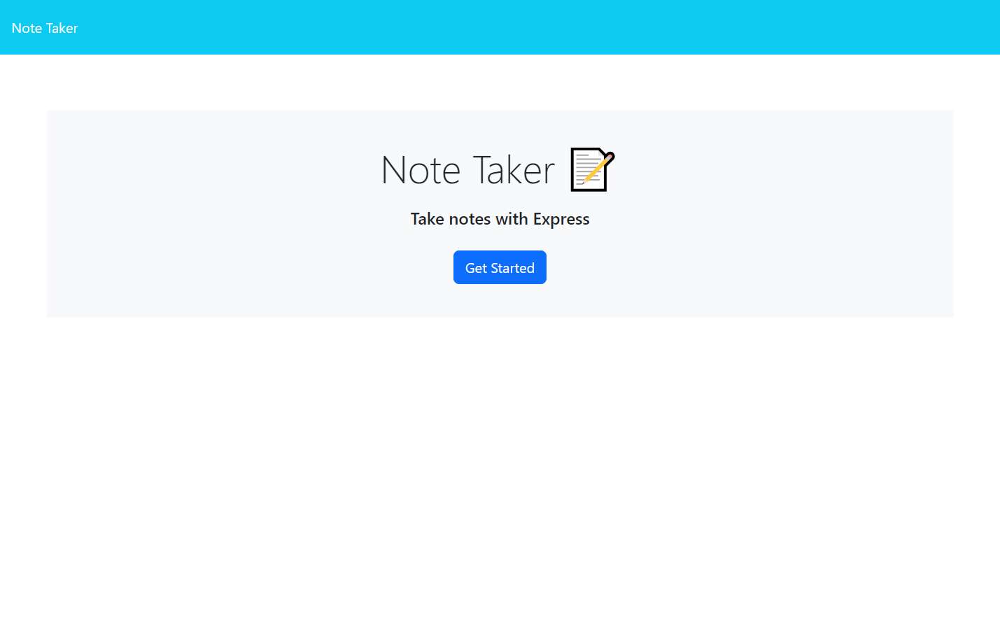
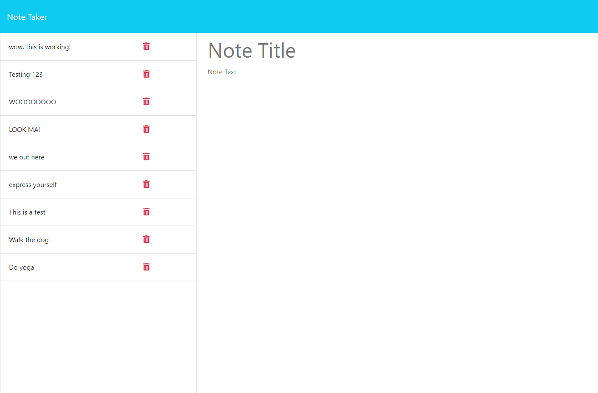

# Express-Note-Taker

   
  ## Description
  An application that can be used to write and save notes.
  
  
  
  ## Table of Contents  
  [Usage](#usage)  
  [License](#license)  
  [Contributing](#contributing)  
  [Tests](#tests)  
  [Questions](#questions) 

  ## Screenshots

  
  

  
  
 
  ## Usage
  As a tool for users to create notes and save them to the server. Your notes will remain until you delete them!

  ## License

This application uses the MIT license: https://opensource.org/licenses/MIT
  ## Contributing
  Please fork the repository, make your edits, and then request to merge back to the main project.
  ## Tests
  N/A
  ## Questions
  If you have any questions, please contact me:  
  <a href="https://github.com/mikedaleo">GitHub</a>  
  or  
  Email: mikejdaleo@gmail.com
